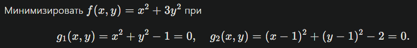
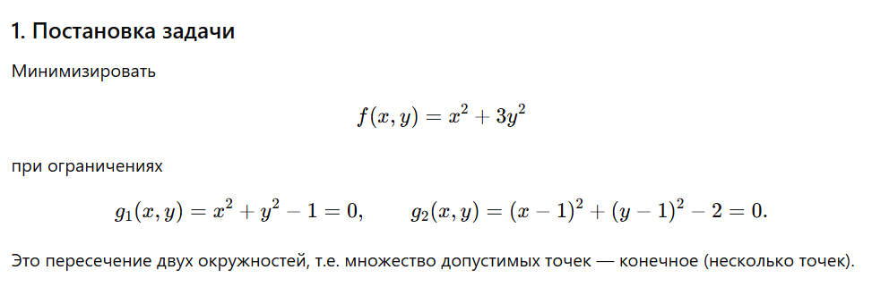
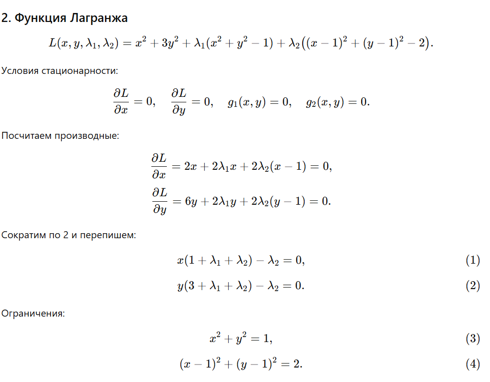
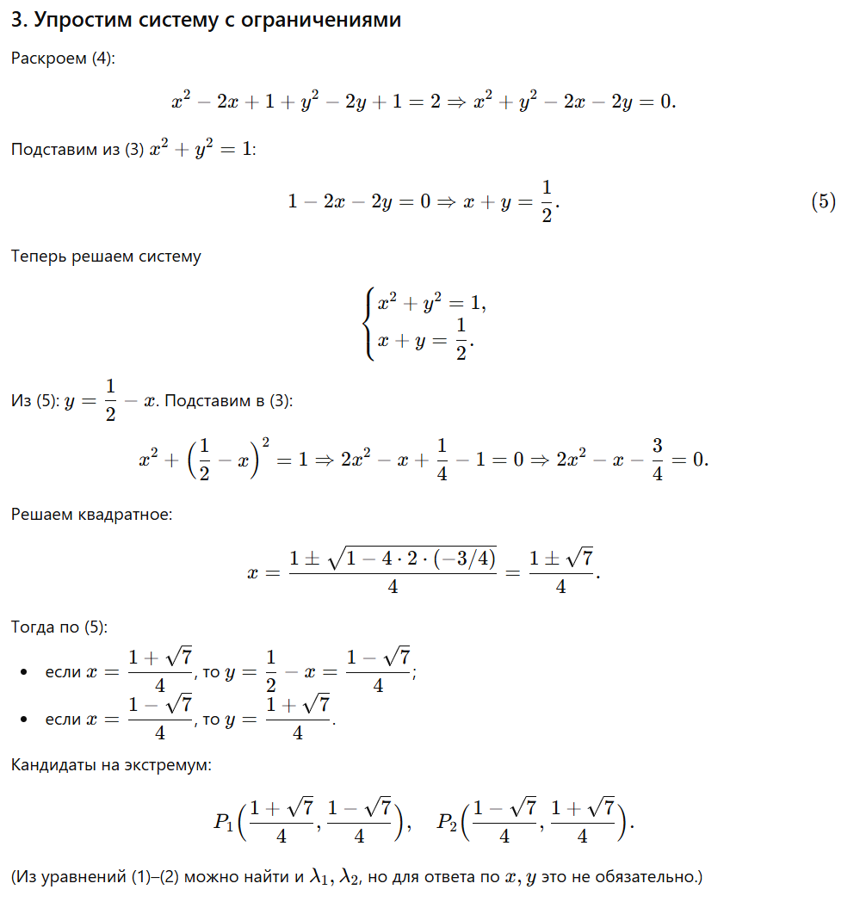
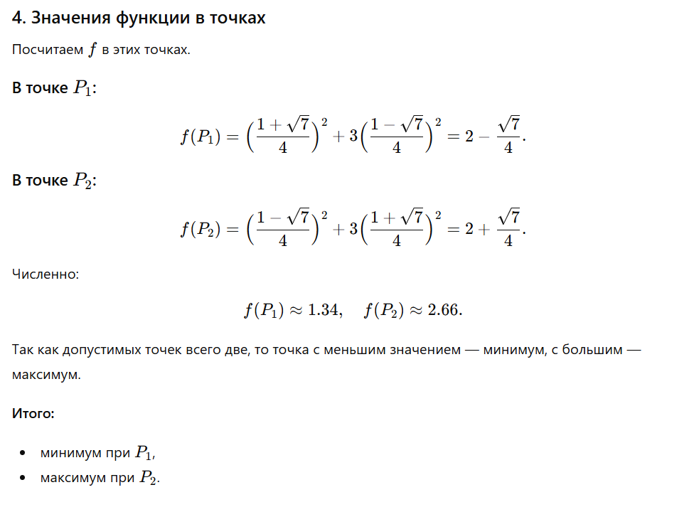
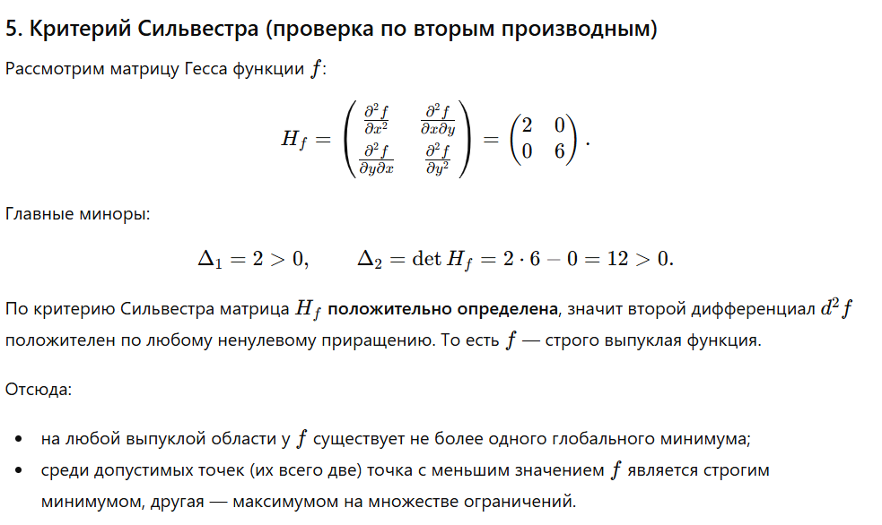

# Задание № 3. Решение задачи условной выпуклой оптимизации с помощью метода множителей Лагранжа

**Выполнил:**  
Ф.И.О: Соболев Артём Анатольевич  
Поток: МЕТОПТ 1.1

---

## Постановка задания

В работе предлагается решить задачу условной оптимизации с помощью метода множителей Лагранжа

Шаблон промпта:

Ниже приведена задача условной оптимизации, которую требуется решить с помощью метода множителей Лагранжа. Она записана в Markdown формате. Пожалуйста идентифицируй задачу и реши ее с помощью метода множителей Лагранжа. Проверь характер найденных точек с помощью критерия Сильвестра.

### Вариант 6



---

## Решение

### Решение БЯМ

БЯМ правильно составил функцию Лангранжа



Производные по x и y вычисленны корректны



БЯМ верно раскрыл второе ограничение, затем подставил первое и получил верную систему



Квадратное уравнение БЯМ решил верно, полученные корны совпадают с ручным решением



Проверка по Критерию Сильвестра была сделена верно. Вывод, что он положительно определён, правильный



БЯМ верно определил точку минимума и правильно отметил, что вторая точка является максимумом по ограниченной области


### Вывод

Решение модели полностью корректное. Ошибок вычислений нет

## Проверка решения с помощью Python

Напишем программу, которая решит задачу условной оптимизации с помощью метода множителей Лагранжа

```python
import sympy as sp

x, y, lam1, lam2 = sp.symbols('x y lam1 lam2', real=True)

# Задаём функцию и ограничения
f = x**2 + 3*y**2
g1 = x**2 + y**2 - 1
g2 = (x - 1)**2 + (y - 1)**2 - 2

# Строим функцию Лагранжа
L = f + lam1*g1 + lam2*g2

# Система уравнений Лагранжа
eqs = [
    sp.diff(L, x),
    sp.diff(L, y),
    g1,
    g2
]

# Решаем систему уравнений
sol = sp.solve(eqs, (x, y, lam1, lam2), dict=True)

print("Найденные стационарные точки")
for i, s in enumerate(sol, start=1):
    x_val = sp.simplify(s[x])
    y_val = sp.simplify(s[y])
    lam1_val = sp.simplify(s[lam1])
    lam2_val = sp.simplify(s[lam2])
    f_val = sp.simplify(f.subs({x: x_val, y: y_val}))

    print(f"\nТочка {i}:")
    print(f"x = {x_val}")
    print(f"y = {y_val}")
    print(f"lambda1 = {lam1_val}")
    print(f"lambda2 = {lam2_val}")
    print(f"Значение функции f(x, y) = {f_val}")

# Гессиан функции f(x, y). Для проверки выпуклости и критерия Сильвестра
H = sp.hessian(f, (x, y))

print("\nПроверка характера по критерию Сильвестра")
print("Гессиан функции f(x, y):")
sp.pprint(H)

d1 = H[0, 0]           # первый главный минор
detH = H.det()         # детерминант Гессиана (второй главный минор)

print(f"\nd1 = {d1}")
print(f"det = {detH}")

if d1 > 0 and detH > 0:
    print("Гессиан положительно определён, функция f(x, y) строго выпуклая")
    print("Это значит, что стационарная точка с минимальным значением f будет строгим минимумом на множестве допустимых точек.")
elif detH < 0:
    print("Гессиан имеет разные знаки по главным минорам - седловая форма")
else:
    print("Неопределённый случай, по одному Гессиану вывод сделать нельзя")

# Поиск точки минимума среди найденных решений
# Сохраняем (x, y, f(x, y)) для всех стационарных точек
results = []
for s in sol:
    x_val = sp.simplify(s[x])
    y_val = sp.simplify(s[y])
    f_val = sp.simplify(f.subs({x: x_val, y: y_val}))
    results.append((x_val, y_val, f_val))

# Выбираем точку с минимальным значением f
min_point = min(results, key=lambda r: sp.N(r[2]))

print("\nИтог")
for i, (x_val, y_val, f_val) in enumerate(results, start=1):
    print(f"Точка {i}: x = {x_val}, y = {y_val}, f(x, y) = {f_val}")

print("\nМинимальное значение функции достигается в точке:")
print(f"x* = {min_point[0]}")
print(f"y* = {min_point[1]}")
print(f"f_min = {min_point[2]}")
```

Вывод:

```
Итог
Точка 1: x = 1/4 - sqrt(7)/4, y = 1/4 + sqrt(7)/4, f(x, y) = sqrt(7)/4 + 2
Точка 2: x = 1/4 + sqrt(7)/4, y = 1/4 - sqrt(7)/4, f(x, y) = 2 - sqrt(7)/4

Минимальное значение функции достигается в точке:
x* = 1/4 + sqrt(7)/4
y* = 1/4 - sqrt(7)/4
f_min = 2 - sqrt(7)/4
```

## Вывод

Решение, полученное с помощью БЯМ, полностью совпадает с ручным вычислением. Модель корректно сформировала функцию Лагранжа, вывела систему уравнений, нашла стационарные точки и проверила их характер на основе критерия Сильвестра. Все математические шаги выполнены верно, в том числе сравнение значений функции в найденных точках. Таким образом, БЯМ успешно решила задачу условной оптимизации и дала корректный итоговый результат
